# I Built a Tool That Lets You Contribute to Open Source in Any Language (And It Actually Preserves the Code Blocks)

#webdev #ai #nextjs #opensource

I was browsing a really interesting React issue on GitHub. Somebody had found a genuinly clever edge case with Suspense boundaries. The discussion was detailed, technical, and... entirely in Mandarin.

I don't speak Mandarin.

So I did what any reasonable developer would do — I highlighted the whole page, pasted it into Google Translate, and watched in horror as every single code snippet got mangled into nonsense. `useEffect` became "use effect". `useState` turned into "use state". A perfectly valid JSX block got translated into what looked like a poem about HTML elements.

I closed the tab. Stared at my monitor. And thought:

> "What if I could translate GitHub issues... without destroying the code?"

That question cost me sleep, mass amounts of caffiene, and one perfectly good weekend. But it also produced **IssueLingo** — a tool that translates entire GitHub issue threads into 38+ languages while keeping every code block, variable name, and terminal command completly untouched.

The part I'm most proud of? You can write a reply in Hindi, see a live verification preview, and then finalize it into perfect English — all without leaving the app.

Here's how I built it.

<!-- 📸 SCREENSHOT #1: Landing Page
     What to capture: The homepage at localhost:3000 showing the URL input field,
     language selector, and the hero text. Use a clean browser window.
     Upload to dev.to image uploader and replace the URL below.
-->
<!--  -->
<!-- *The IssueLingo landing page. Paste any GitHub issue URL. Choose your language. Break the barrier.* -->

---

## 🎨 The Blank Canvas — What I Had Before Writing a Single Line

This project was built for the **Lingo.dev Hackathon**, which meant one hard constraint: the core translation functionality had to use the Lingo.dev SDK. Beyond that, I was on my own.

Here's what my "starting position" looked like:

**APIs I knew I'd be using:**
- **GitHub REST API** — free, no auth needed for public repos (though rate-limited to 60 req/hr without a token)
- **Lingo.dev SDK** — three key methods: `localizeObject()` for structured data, `localizeText()` for strings, and `recognizeLocale()` for auto-detecting languages
- **Google Gemini 2.5 Flash** — free tier with a generous-enough context window for summarization

**The hard problems I needed to solve:**
1. How do you translate markdown without destroying code blocks? (Google Translate sure can't)
2. How do you let someone verify a translation if they don't speak the target language?
3. How do you build AI features on free-tier API limits without the app falling over every 5 minutes?

**Time constraint:** One weekend. No pressure. Just kidding — all the pressure.

I opened VS Code, ran `npx create-next-app@latest`, and started building.

---

## 🤔 Why This Stack (And Not the Obvious Alternatives)

Before writing code, I had to make some architectural decisions. Here's what I considered and why I went the direction I did.

```mermaid
flowchart TD
    subgraph Translation["🔤 Translation Engine"]
        direction LR
        GT["Google Translate API\n❌ Flat strings only\n❌ N calls for N items\n❌ No context"]
        DL["DeepL API\n❌ Flat strings only\n❌ N calls for N items\n❌ No context"]
        LD["Lingo.dev SDK\n✅ localizeObject\n✅ 1 call for all\n✅ Full context"]
    end
    subgraph AI["🧠 AI Model"]
        direction LR
        GPT["GPT-4\n❌ Paid from req 1\n❌ Slow 2-5s\n❌ No key rotation"]
        CL["Claude\n❌ Limited free\n❌ Medium 1-3s\n❌ No key rotation"]
        GF["Gemini Flash\n✅ Generous free tier\n✅ Fast under 1s\n✅ Key rotation"]
    end
    subgraph Platform["🖥️ Platform"]
        direction LR
        CE["Chrome Extension\n❌ Exposed API keys\n❌ CORS blocked\n❌ No UI control"]
        SPA["SPA + Backend\n❌ CORS headaches\n❌ 2 deploys\n❌ More complex"]
        NJ["Next.js App\n✅ API routes as proxy\n✅ No CORS issues\n✅ Full UI control"]
    end
    LD --> |CHOSEN| RESULT["🎯 Final Stack"]
    GF --> |CHOSEN| RESULT
    NJ --> |CHOSEN| RESULT

    style LD fill:#1b4332,stroke:#40916c,color:#fff
    style GF fill:#1b4332,stroke:#40916c,color:#fff
    style NJ fill:#1b4332,stroke:#40916c,color:#fff
    style GT fill:#3d0000,stroke:#e94560,color:#fff
    style DL fill:#3d0000,stroke:#e94560,color:#fff
    style GPT fill:#3d0000,stroke:#e94560,color:#fff
    style CL fill:#3d0000,stroke:#e94560,color:#fff
    style CE fill:#3d0000,stroke:#e94560,color:#fff
    style SPA fill:#3d0000,stroke:#e94560,color:#fff
    style RESULT fill:#0f3460,stroke:#e94560,color:#fff
```

### Why Lingo.dev over Google Translate API / DeepL?

Besides the hackathon requirement, Lingo.dev has one killer feature: `localizeObject()`. Instead of translating strings one at a time, you pass in an entire JavaScript object — title, body, array of comments — and it translates every string value while preserving the structure. One API call for an entire GitHub thread with full conversational context. Google Translate doesn't do that. DeepL doesn't do that. This single method shaped the entire architecture.

### Why Gemini 2.5 Flash over GPT-4 / Claude?

Three words: free tier generosity. GPT-4 costs money from request #1. Claude's free tier is limited. Gemini gives you enough free calls to build real features — and with key rotation (more on that later), you can multiply that limit. Plus, Flash is fast enough for interactive use. Nobody wants to wait 8 seconds for a summary.

### Why Next.js App Router over a browser extension?

I seriously considered building a Chrome extension that would translate issues inline on GitHub. But:
- API keys would be exposed in the client-side extension code
- CORS would block calls to Lingo.dev and Gemini from a content script
- I'd lose control over the UI and be fighting GitHub's DOM

Next.js solved all three: API routes act as a server-side proxy (no CORS, no exposed keys), and I get full control over the rendering. File-based routing meant I could scaffold 6 API endpoints in minutes.

---

## 🏗️ The Architecture

Here's what IssueLingo does at a high level:

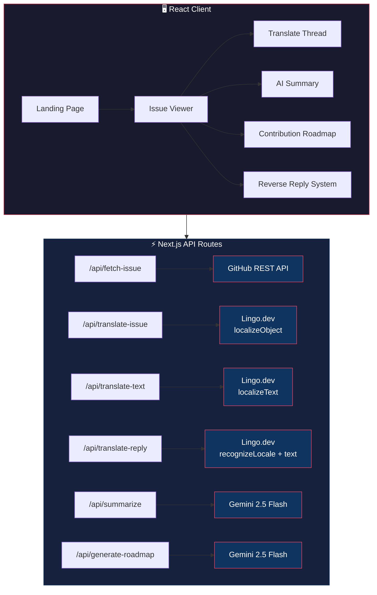

The React app is the brain. The API routes are the translators. Lingo.dev handles the heavy lifting of actual translation, and Gemini does the "thinking" parts — summarization and roadmap generation.

Project structure for refrence:

```
src/
├── app/
│   ├── page.tsx                    # Landing page with URL input
│   ├── issue/[...slug]/page.tsx    # Issue viewer (the main feature page)
│   ├── api/
│   │   ├── fetch-issue/route.ts    # GitHub API proxy
│   │   ├── translate-issue/route.ts # Full thread translation (Lingo.dev)
│   │   ├── translate-text/route.ts  # Single text translation + code protection
│   │   ├── translate-reply/route.ts # Reply → English translation
│   │   ├── summarize/route.ts       # AI summary (Gemini)
│   │   └── generate-roadmap/route.ts # AI contribution roadmap (Gemini)
│   ├── globals.css                  # GitHub-flavored markdown styles
│   └── layout.tsx
├── components/
│   ├── IssueCommentCard.tsx         # Comment card with per-comment translate
│   └── LanguageSelector.tsx         # 38-language region-based selector
└── lib/
    ├── gemini.ts                    # Gemini key rotation + retry logic
    ├── languages.ts                 # Language definitions + regions
    └── utils.ts                     # cn() utility (the classic)
```

---

## 🛡️ The "Don't Touch My Code" Translation Engine

**If I had to isolate 15-20 lines of code that represent my biggest breakthrough in this project, it's these.**

This one nearly broke me.

The entire point of IssueLingo is translating GitHub issues. GitHub issues are full of code. If your translator turns `npm install` into `npm instalar` (actual thing that happend), you've failed.

So I built a protection system. Before any text hits the translation API, we surgically extract every code block and inline code snippet, replace them with placeholders, translate only the prose, and then stitch the code back in.

```typescript
// src/app/api/translate-text/route.ts

// --- Markdown Protection Logic ---
const protectedBlocks: string[] = [];
let protectedText = text;

// 1. Protect fenced code blocks (```...```)
protectedText = protectedText.replace(/```[\s\S]*?```/g, (match: string) => {
    const placeholder = `[[PROTECTED_BLOCK_${protectedBlocks.length}]]`;
    protectedBlocks.push(match);
    return placeholder;
});

// 2. Protect inline code (`...`)
protectedText = protectedText.replace(/`[^`\n]+`/g, (match: string) => {
    const placeholder = `[[PROTECTED_BLOCK_${protectedBlocks.length}]]`;
    protectedBlocks.push(match);
    return placeholder;
});

// 3. Translate only the prose
translatedText = await lingo.localizeText(protectedText, {
    sourceLocale: sourceLocale,
    targetLocale: targetLocale,
});

// 4. Restore protected blocks
protectedBlocks.forEach((originalContent, index) => {
    const placeholder = `[[PROTECTED_BLOCK_${index}]]`;
    // Use split/join instead of replace to avoid regex special chars
    translatedText = translatedText.split(placeholder).join(originalContent);
});
```

Notice that last part — `split/join` instead of `.replace()`. I learned this the hard way. If your code block contains `$1` or `$&` or any regex special characters (which JavaScript code absolutly does), `.replace()` will interpret them as replacement patterns and produce garbage. Split/join treats everything as a literal string.

That bug cost me 2 hours of staring at output where translated comments had random dollar signs appearing and disappearing like some kind of haunted ATM.

### The Protection Flow

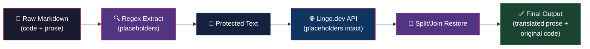

Here's what each stage looks like in practise:

| Stage | Example |
|-------|--------|
| Raw Input | "Run `npm install` to setup the dependancies" |
| After Protection | "Run [[PROTECTED_BLOCK_0]] to setup the dependancies" |
| After Translation (→ Spanish) | "Ejecute [[PROTECTED_BLOCK_0]] para configurar las dependencias" |
| After Restoration | "Ejecute `npm install` para configurar las dependencias" |

`npm install` survived. The translator never even saw it. Mission acomplished. 🎯

<!-- 📸 SCREENSHOT #2: Code-Safe Translation
     What to capture: Side-by-side (or before/after) showing an issue with code blocks
     in English on one side, and the same issue translated to Spanish/Hindi on the other.
     Show that code blocks like `useEffect`, `npm install` are untouched.
-->
<!--  -->
<!-- *Left: the raw issue with code blocks. Right: translated to Spanish — every useEffect and git rebase survived the journey untouched.* -->

---

## 🌐 Translating an Entire Thread in One API Call

Most translation tools work one string at a time. You send "Hello", you get back "Hola". Simple. But a GitHub issue thread isn't one string — it's a title, a body (often 500+ words of markdown), and anywhere from 5 to 50 comments.

If you translate each piece individually, thats dozens of API calls. Slow. Expensive. And the translations lose context — the AI doesn't know that Comment 3 is responding to Comment 1, so it might translate the same technical term differently each time.

My solution: pack everything into a single object and translate it all at once.

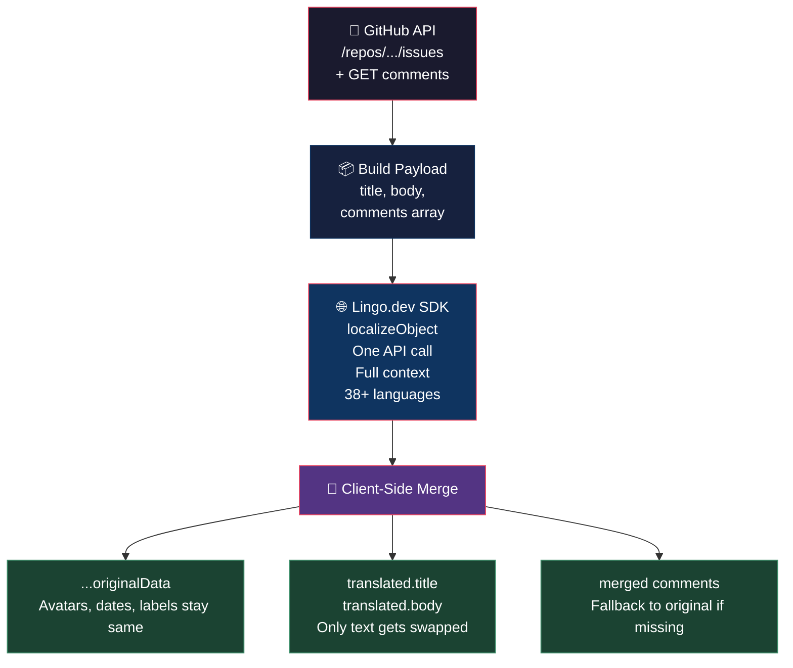

```typescript
// src/app/api/translate-issue/route.ts

const lingo = new LingoDotDevEngine({
    apiKey: process.env.LINGO_API_KEY || ''
});

// One object. One API call. Full context preserved.
localizedPayload = await lingo.localizeObject(payloadObject, {
    sourceLocale: 'en',
    targetLocale: targetLocale,
});
```

The `payloadObject` looks like this:

```json
{
    "title": "useEffect cleanup not firing on unmount",
    "body": "When I navigate away from the page, the cleanup function...",
    "comments": [
        "I can reproduce this on React 18.2...",
        "Have you tried wrapping it in StrictMode?",
        "Fixed in commit abc123"
    ]
}
```

Lingo.dev's `localizeObject()` translates every string value in the object while preserving the structure. One call, full thread, all context maintained. The AI sees the entire conversation so "cleanup" gets translated consistently across all comments.

On the client side, we merge the translated payload back into our existing data structure:

```typescript
setTranslatedIssueData({
    ...issueData,
    title: localizedPayload.title,
    body: localizedPayload.body,
    comments: issueData.comments.map((c, index) => ({
        ...c,
        body: localizedPayload.comments[index] || c.body
    }))
});
```

Spread the original data (avatars, dates, labels stay the same), overlay the translated text. The `|| c.body` fallback means if translation somehow misses a comment, we show the orignal instead of an empty string.

I also built a fallback for when the API key isn't configured (becuase I know half of you will clone this and forget to set up `.env`):

```typescript
} catch (translateError) {
    // Fallback: at least show SOMETHING
    localizedPayload = {
        title: `[Translated to ${targetLanguage}] ` + payloadObject.title,
        body: `[Translated to ${targetLanguage}]\n\n` + payloadObject.body,
        comments: payloadObject.comments.map(
            (c: string) => `[Translated to ${targetLanguage}]\n\n` + c
        )
    };
}
```

Is it a good translation? No. Does it prevent the app from crashing? Yes. Ship it. 🚀

<!-- 📸 SCREENSHOT #3: Full Thread Translation
     What to capture: The issue viewer page showing a full thread translated to Japanese
     or Hindi. Include the title, body, and at least 2 translated comments visible.
     The floating toolbar at the bottom should be visible.
-->
<!--  -->
<!-- *An entire React issue thread translated to Japanese. Title, body, all comments — one click. Code blocks? Still in English where they belong.* -->

---

## 🧠 AI That Actually Understands Issues (Not Just Translates Them)

Translation is step one. But when you're staring at a 47-comment thread about a race condition in a caching layer, what you realy need is someone to say: "Here's what's broken, here's the current status, and here's how you can help."

Enter the AI Summary and Contribution Roadmap features, both powered by Google Gemini 2.5 Flash.

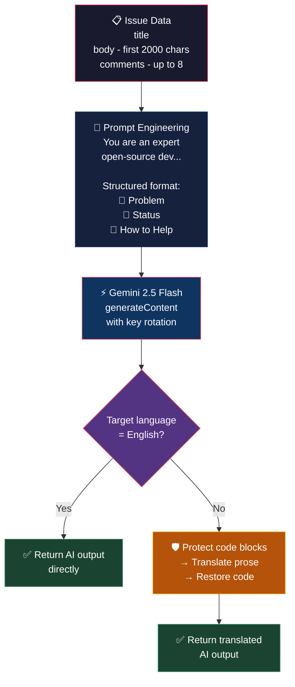

### The AI Summary

The summary endpoint takes the issue title, body, and up to 8 comments, then asks Gemini to produce a structured breakdown:

```typescript
// src/app/api/summarize/route.ts

const prompt = `
You are an expert open-source developer. Read the following GitHub 
issue thread and produce a CONCISE developer summary.

Issue Title: ${title}

Issue Body:
${body.substring(0, 2000)}

${commentsContext ? `Latest Comments:\n${commentsContext.substring(0, 2000)}` : ''}

Your response must be in exactly this format:

## 🐛 The Problem
[One sentence describing the core bug or request]

## 📍 Current Status
[One sentence on where the discussion is now]

## 🙋 How You Can Help
[One sentence on what kind of contributor is needed]

Keep each section to 1-2 sentences. Be technical and precise.
`;

const aiSummary = await callGeminiWithRotation(prompt);
```

The key design decision: **cap the input**. We take `substring(0, 2000)` of the body and comments. Why? Because Gemini has a context window, and also becuase most of the signal in a GitHub issue is in the first few comments. Comment #47 saying "any updates?" adds zero information.

### The Contribution Roadmap

This is the feature I'm most proud of. Instead of just summarizing whats wrong, it tells you exactly how to fix it:

```typescript
// src/app/api/generate-roadmap/route.ts

const prompt = `
Analyze this GitHub issue and create a detailed 
"Contribution Roadmap" for a new contributor.

...

Generate a structured Contribution Roadmap in Markdown:

## 🎯 Objective
One clear sentence: what needs to be built or fixed.

## 🔍 Investigation Steps
Numbered list of WHERE to look in the codebase.

## ⚙️ Implementation Plan
Step-by-step concrete code changes.

## ✅ How to Verify the Fix
Test commands or manual steps to confirm it works.

## 💡 Tips & Gotchas
1-3 bullet points of tricky edge cases.
`;
```

The roadmap gets rendered with full markdown support (headings, lists, code blocks) and even the code blocks inside the roadmap are protected before translation. It's turtles all the way down.

### Translating AI Output

Both the summary and roadmap support translation into the user's selected language. The flow is:

1. Gemini generates the content in English (it's most accurate in English)
2. If the user's target language isn't English, we translate the output using Lingo.dev
3. Code blocks in the roadmap are protected during this translation step too

```typescript
if (targetLanguage && targetLanguage !== 'en') {
    const lingo = new LingoDotDevEngine({ apiKey: process.env.LINGO_API_KEY! });

    // Protect code blocks before translating the AI output
    let protectedText = aiRoadmap;
    protectedText = protectedText.replace(/```[\s\S]*?```/g, (match) => {
        const placeholder = `[[PROTECTED_${protectedBlocks.length}]]`;
        protectedBlocks.push(match);
        return placeholder;
    });

    let translated = await lingo.localizeText(protectedText, {
        sourceLocale: 'en',
        targetLocale: targetLanguage,
    });

    // Restore code blocks
    protectedBlocks.forEach((original, i) => {
        translated = translated.split(`[[PROTECTED_${i}]]`).join(original);
    });

    return NextResponse.json({ roadmap: translated });
}
```

So you can get a contribution roadmap for a Japanese issue, translated into Hindi, with all the `git checkout` commands still in English. It's beautifull.

<!-- 📸 SCREENSHOT #4: AI Summary + Contribution Roadmap
     What to capture: Show both panels open — the AI Summary (with 🐛 Problem,
     📍 Status, 🙋 How to Help sections) and the Contribution Roadmap (with
     🎯 Objective, 🔍 Investigation Steps, etc). Can be two screenshots stitched.
-->
<!--  -->
<!-- *Top: The AI Summary panel — three sections, zero fluff. Bottom: The Contribution Roadmap — step-by-step instructions for your first PR. Both powered by Gemini 2.5 Flash.* -->

---

## ✍️ The Reverse Reply System — Write in Any Language, Post in English

This is the feature that makes IssueLingo more than just a reader. It turns you into a contributor.

The problem: you find a bug, you know exaclty whats wrong, you want to comment on the issue... but you think in Bengali or Arabic or Spanish, and writing technical English is slow and error-prone.

IssueLingo's Reverse Reply system works in three steps:

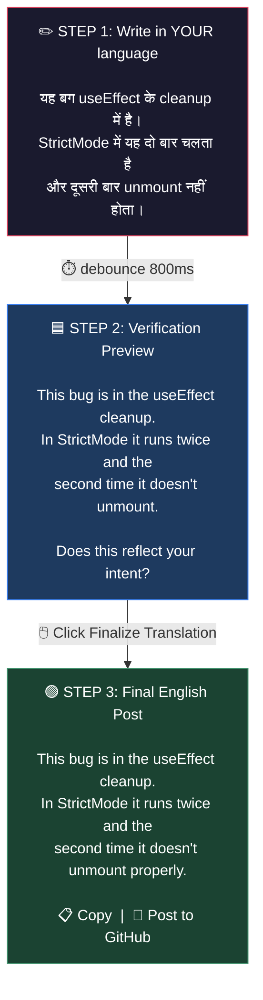

The magic is in the live preview. As you type, a debounced function fires every 800ms and translates your text:

```typescript
const handleReplyInput = (e: React.ChangeEvent<HTMLTextAreaElement>) => {
    const val = e.target.value;
    setReplyText(val);
    setTranslatedReply('');
    if (!val.trim() || val.length < 5) { setLivePreview(''); return; }

    if (livePreviewDebounce.current) clearTimeout(livePreviewDebounce.current);

    livePreviewDebounce.current = setTimeout(async () => {
        setIsLivePreviewing(true);
        try {
            const res = await fetch('/api/translate-text', {
                method: 'POST',
                headers: { 'Content-Type': 'application/json' },
                body: JSON.stringify({
                    text: val,
                    targetLanguage: targetLanguage  // YOUR language for verification
                }),
            });
            const data = await res.json();
            setLivePreview(data.translatedText || '');
        } catch { }
        finally { setIsLivePreviewing(false); }
    }, 800);
};
```

Notice something subtle: the verification preview translates to the **user's selected language**, not to English. Why? Because if you wrote in Hindi and I show you an English preview, you can't verify if it's correct — that's the langauge you're trying to avoid writing in! Instead, we translate your Hindi to... Hindi. If the back-translation matches your intent, the AI understood you correctly.

Only when you click "Finalize Translation" do we call the separate `/api/translate-reply` endpoint that always outputs English:

```typescript
// src/app/api/translate-reply/route.ts

const sourceLocale = await lingo.recognizeLocale(text).catch(() => null);

translatedText = await lingo.localizeText(text, {
    sourceLocale: sourceLocale,  // Auto-detected!
    targetLocale: 'en',          // Always English for GitHub
});
```

The `recognizeLocale()` call auto-detects the source language. No dropdown needed. Write in whatever language your brain thinks in, and Lingo.dev figures out the rest.

Then there's the "Post to GitHub" button which copies the English text and opens the actual GitHub issue in a new tab — so you can paste it directly into the comment box. One click to go from "reply in Hindi" to "posted on GitHub in English."

<!-- 📸 SCREENSHOT #5: Reverse Reply System
     What to capture: The reply section showing all 3 steps visible:
     (1) The textarea with text in Hindi/Arabic/Spanish,
     (2) The blue verification preview box,
     (3) The green finalized English box with Copy/Post buttons.
-->
<!--  -->
<!-- *Write in your language → verify the preview → finalize to English → post to GitHub. The complete reply flow.* -->

---

## 🔑 The Gemini Key Rotation Trick (AKA How to Use Free Tier Like a Pro)

Gemini's free tier gives you... not a lot of requests per minute. If you're building a tool that makes multiple AI calls per user interaction (summary + roadmap + translations), you'll hit rate limits faster than you can say "429 Too Many Requests".

My solution: API key rotation.

```typescript
// src/lib/gemini.ts

let currentIndex = 0;

function getApiKeys(): string[] {
    const keys: string[] = [];
    let i = 1;
    while (true) {
        const key = process.env[`GEMINI_API_KEY_${i}`];
        if (!key) break;
        if (!key.toLowerCase().includes('your_')) {
            keys.push(key);
        }
        i++;
    }
    // Fallback: check for a single GEMINI_API_KEY
    if (keys.length === 0 && process.env.GEMINI_API_KEY) {
        keys.push(process.env.GEMINI_API_KEY);
    }
    return keys;
}
```

You add keys to your `.env` like this:

```
GEMINI_API_KEY_1=AIzaSy...
GEMINI_API_KEY_2=AIzaSy...
GEMINI_API_KEY_3=AIzaSy...
```

The rotator picks the next key on each call using round-robin:

```typescript
export function getNextGeminiClient() {
    const keys = getApiKeys();
    const keyIndex = currentIndex % keys.length;
    currentIndex = (currentIndex + 1) % keys.length;
    return {
        client: new GoogleGenerativeAI(keys[keyIndex]),
        keyIndex: keyIndex + 1,
    };
}
```

But here's the clever part — if a key hits a 429, we dont just fail. We try the next key:

```typescript
export async function callGeminiWithRotation(
    prompt: string,
    modelName = 'gemini-2.5-flash'
): Promise<string> {
    const keys = getApiKeys();
    let lastError: Error | null = null;

    // Try each key at most once
    for (let attempt = 0; attempt < keys.length; attempt++) {
        try {
            const { client } = getNextGeminiClient();
            const model = client.getGenerativeModel({ model: modelName });
            const result = await model.generateContent(prompt);
            return result.response.text();
        } catch (err: any) {
            lastError = err;
            // Rate limited? Try the next key
            if (err?.status === 429 || err?.message?.includes('429')) {
                continue;
            }
            // Other errors bubble up immediatly
            throw err;
        }
    }
    throw lastError ?? new Error('All Gemini API keys exhausted.');
}
```

With 3 free-tier keys, you effectivly triple your rate limit. It's not infinity, but it's enough for a hackathon demo where you're nervously refreshing the page while a judge watches over your sholder.

The `includes('your_')` check is a nice touch too — it filters out placeholder values like `your_api_key_here` that people forget to replace. Ask me how I know. 🙄


Three keys. Three chances. One of them will work. Probaly.

---

## 🔍 Highlight-to-Translate — The Feature Nobody Asked For But Everyone Uses

Sometimes you don't want to translate the entire thread. You just want to know what that one sentence means. Maybe it's a code review comment in Korean and you just need the third paragraph.

IssueLingo lets you highlight any text in a comment and get an instant floating translation:

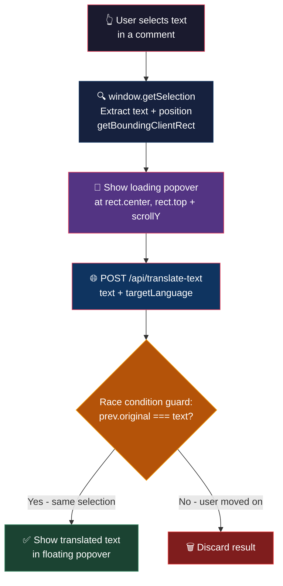

```typescript
// src/components/IssueCommentCard.tsx

const handleSelection = async () => {
    const selection = window.getSelection();
    if (!selection || selection.isCollapsed) {
        if (selectionTranslation && !selectionTranslation.isLoading) {
            setSelectionTranslation(null);
        }
        return;
    }

    const text = selection.toString().trim();
    if (!text || text === selectionTranslation?.original) return;

    // Position the popover near the selection
    const range = selection.getRangeAt(0);
    const rect = range.getBoundingClientRect();

    setSelectionTranslation({
        original: text,
        translated: '',
        isLoading: true,
        position: {
            x: rect.left + rect.width / 2,
            y: rect.top + window.scrollY
        }
    });

    try {
        const response = await fetch('/api/translate-text', {
            method: 'POST',
            headers: { 'Content-Type': 'application/json' },
            body: JSON.stringify({ text, targetLanguage })
        });
        const data = await response.json();

        // Make sure the selection hasn't changed while we were fetching
        setSelectionTranslation(prev => {
            if (prev?.original === text) {
                return { ...prev, translated: data.translatedText, isLoading: false };
            }
            return prev; // Selection changed, discard this result
        });
    } catch (e) {
        setSelectionTranslation(null);
        toast.error('Failed to translate selection');
    }
};
```

<!-- 📸 SCREENSHOT #6: Highlight-to-Translate
     What to capture: A comment with some text highlighted/selected, and the
     floating translation popover bubble appearing above the selection.
-->
<!--  -->
<!-- *Select any text in a comment → floating popover shows the instant translation.* -->

The positioning math is tricky. `getBoundingClientRect()` gives you coordinates relative to the viewport, but we need to add `window.scrollY` for the absolute position. There's also a race condition guard — if the user highlights new text while a translation is in-flight, we check that `prev?.original === text` before updating. Otherwise you get a translation for Sentence A appearing next to Sentence B, which is confusing and also kind of hilarious.

---

## ⚡ Other Notable Features

Beyond the core translation and AI features, here are some other things I built that are worth mentioning:

### 📊 Difficulty Meter

Before you spend 3 hours trying to contribute, IssueLingo gives you a gut check. It computes a difficulty score from the issue data using pure client-side heuristics — no AI needed:

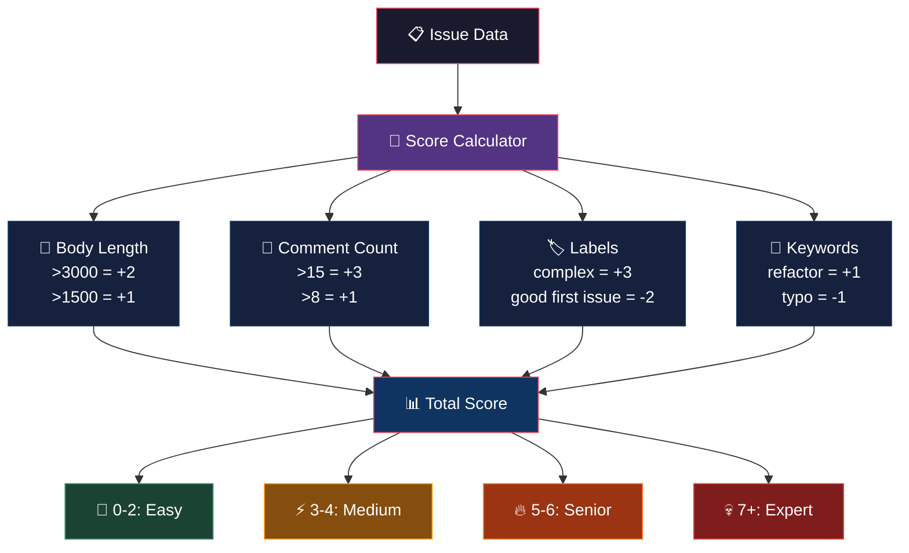

| Signal | Impact | Reasoning |
|--------|--------|-----------|
| Body + comments > 3000 chars | +2 | Long threads = complex issues |
| More than 15 comments | +3 | Lots of debate = no easy answer |
| Label contains "complex" or "core" | +3 | Maintainers flagged it as hard |
| Label contains "good first issue" | -2 | Maintainers flagged it as easy |

Four difficulty levels:

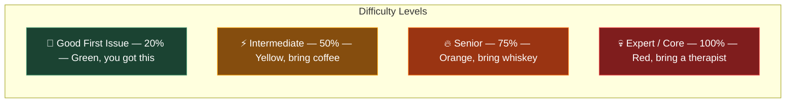

### 🌍 38-Language Region Selector

A flat dropdown with 38 languages is unusable. Instead, I built a region-tabbed selector with 7 regions (European, East Asian, South Asian, Southeast Asian, Middle Eastern, African, Americas). It has a search bar that filters across name, native name, AND language code — so typing "por" matches both "Portuguese" and "Português (Brasil)". Native names are shown first because if you're looking for हिन्दी, you'll recognize it faster than "Hindi".

### 🎨 GitHub-Flavored Markdown Rendering

Issues are rendered with `react-markdown` plus three plugins: `remark-gfm` (tables, strikethrough, task lists), `remark-breaks` (newlines → `<br>` like GitHub), and `rehype-raw` (raw HTML like `<details>` tags). Custom CSS matches GitHub's dark theme — alternating table row colors, border-bottom dividers on headings, the gray pill background on inline code. Was it necessary? No. Did I spend 3 hours on it? Absolutley.

### ⚡ Parallel GitHub Fetching

When you paste a URL, we fetch the issue and comments simultaneously:

```typescript
const [issueRes, commentsRes] = await Promise.all([
    fetch(`https://api.github.com/repos/${owner}/${repo}/issues/${issueNumber}`, { headers }),
    fetch(`https://api.github.com/repos/${owner}/${repo}/issues/${issueNumber}/comments?per_page=5`, { headers })
]);
```

Two requests, one `await`. Saves 200-400ms. The optional `GITHUB_TOKEN` bumps rate limits from 60 to 5000 req/hr.

### 🔄 Per-Comment Translation Toggle

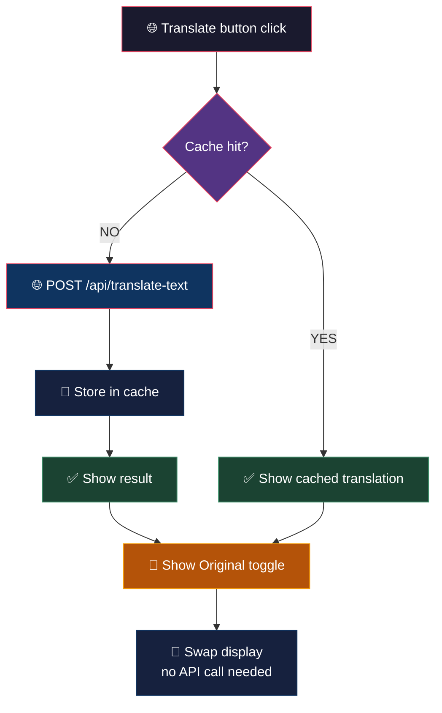

Each comment has its own translate button. Click once to translate, click again to toggle back. Cached per-comment so toggling is instant after the first call. Useful when most of the thread is in English but one person replied in Portuguese.

### 🎭 Floating Glassmorphic Toolbar

The translation toolbar lives at the bottom of the screen using `backdrop-blur-xl`, layered borders, and a box shadow. Always visible, never in the way. It looks like a floating control panel from a sci-fi movie and I'm not sorry.

### Translation Method Comparison

| Method | Scope | API Calls | Best For |
|--------|-------|-----------|----------|
| Translate Thread | Entire issue + all comments | 1 (localizeObject) | Full translation of foreign-language issues |
| Per-Comment Toggle | Single comment | 1-2 (body + title) | One comment in a different language |
| Highlight Selection | A few words or sentences | 1 | Quick lookup of unfamiliar terms |
| Reverse Reply | Your drafted reply | 1 per debounce | Writing replies in your language |

Four levels of translation granularity. Use whichever one fits the situation. Or use all four. I'm not your boss.

---

## 💥 Where Reality Hit

Every project has a moment where the clean design in your head collides with the messy reality of implementation. Here's where mine broke:

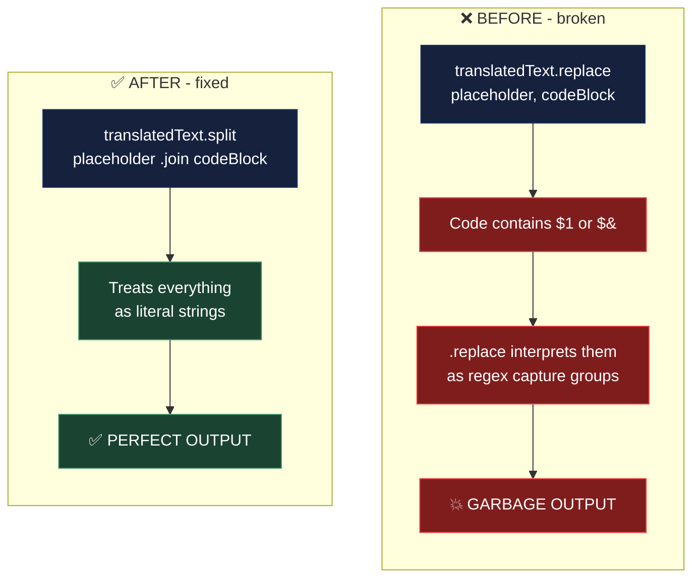

**The `.replace()` Disaster:** I originally used JavaScript's `.replace()` method to restore code blocks after translation. Clean, simple, obvious. Except `.replace()` treats `$1`, `$&`, and `$$` as special replacement patterns. JavaScript code is full of dollar signs. The output was a mangled mess of phantom characters. The fix? `split(placeholder).join(original)` — ugly but bulletproof. One line of code, three hours of debugging.

**The Live Preview API Flood:** I initially set the debounce on the reply preview to 200ms. Fast feedback, right? Wrong. Every keystroke triggered a translation API call. The translation response updated state, re-rendered the textarea, fired onChange, triggered another translation. My Lingo.dev dashboard showed **847 API calls in 3 minutes**. I cranked the debounce to 800ms and added a 5-character minimum threshold. My API bill breathed a sigh of relief.

**The "Post to GitHub" Compromise:** I wanted direct GitHub posting — type your reply, click post, done. But that requires full OAuth flow (redirect to GitHub, get a token, handle scopes, store credentials). For a hackathon weekend? Too much. So I compromised: copy the English text to clipboard and open the GitHub issue in a new tab. Two clicks instead of one. Not perfect, but shippable.

**The `sourceLocale: 'en'` Assumption:** Thread translation hardcodes the source as English. But what if the issue is in Japanese? Auto-detection for structured objects was unreliable — the SDK's `recognizeLocale()` works great for plain text but gets confused when you pass it an object with mixed-language content (Japanese body, English code comments). For the hackathon, hardcoding 'en' was the pragmatic choice.

**The z-index War:** The language selector dropdown kept disappearing behind the page content. I spent an embarrassing amount of time adding `z-50` to the dropdown before it finally floated above everything. CSS: where the simplest problems take the longest to solve.

---

## 🐛 Bugs That Made Me Question My Career

### Bug #1: The Infinite Translation Loop

During development, the live preview debounce was set to 200ms. Every keystroke triggered a translation. The translation response updated state → re-render → onChange → another translation. My Lingo.dev dashboard showed 847 API calls in 3 minutes.

**Fix:** Increased debounce to 800ms and added a minimum text length check (`val.length < 5`). Also made sure the onChange handler only fires on actual user input, not on state-driven re-renders. My API bill thanks me.

### Bug #2: The Selection Popover That Followed You Home

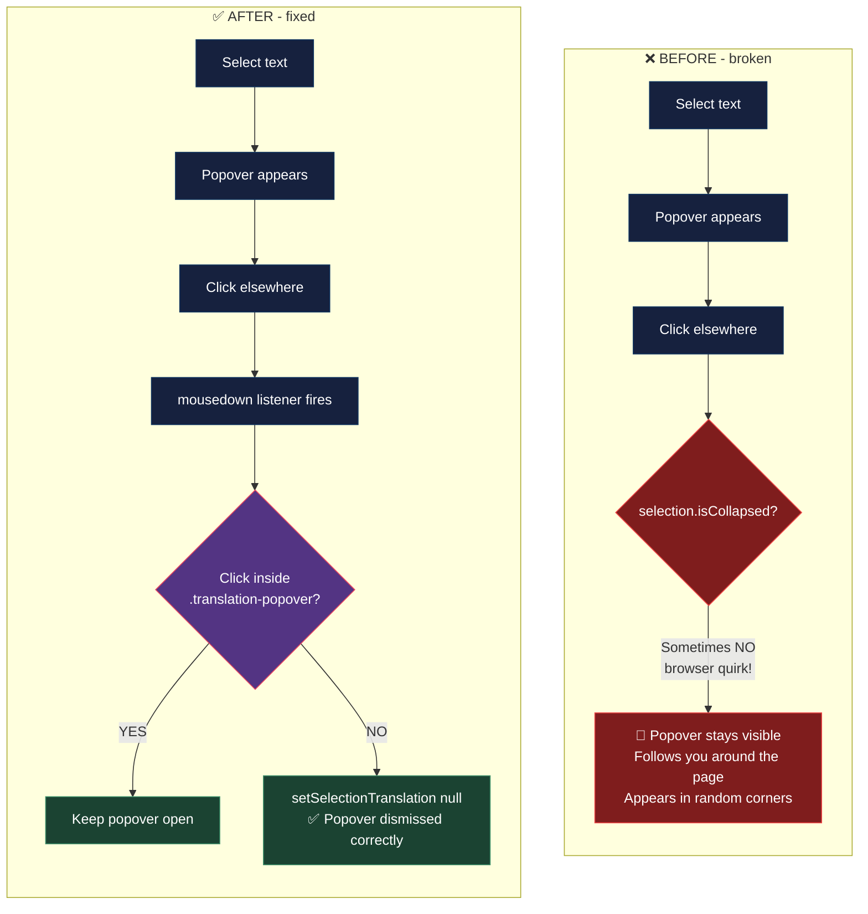

The highlight-to-translate popover was supposed to disappear when you click somewhere else. Instead, it would persist across page scrolls, follow you to different comments, and ocasionally appear in the corner of the screen like a lost tooltip looking for its parent element.

**Root cause:** I was only checking `selection.isCollapsed` to dismiss the popover, but click events don't always collapse the selection immediatly. Some browsers preserve the selection after a click on empty space.

**Fix:** Added a proper `mousedown` event listener on the document that checks if the click is outside the popover:

```typescript
useEffect(() => {
    const handleClickOutside = (e: MouseEvent) => {
        if (selectionTranslation && !selectionTranslation.isLoading) {
            const target = e.target as HTMLElement;
            if (!target.closest('.translation-popover')) {
                setSelectionTranslation(null);
            }
        }
    };
    document.addEventListener('mousedown', handleClickOutside);
    return () => document.removeEventListener('mousedown', handleClickOutside);
}, [selectionTranslation]);
```

### Bug #3: Language Cache Invalidation

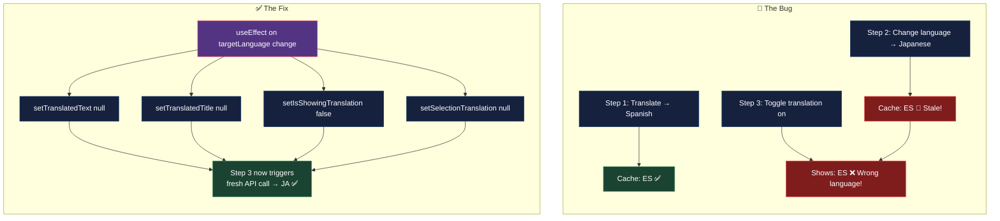

You translate a comment to Spanish. Then you change the target language to Japanese. The Spanish translation is still cached. You toggle the translation on/off and see... Spanish. Not Japanese.

**Fix:** Clear the translation cache whenever the target language changes:

```typescript
useEffect(() => {
    setTranslatedText(null);
    setTranslatedTitle(null);
    setIsShowingTranslation(false);
    setSelectionTranslation(null);
}, [targetLanguage]);
```

Two of the hardest problems in computer science: cache invalidation, naming things, and off-by-one errors.

---

## ⚖️ Trade-offs I Accepted

Looking critically at the finished code, here are the specific trade-offs and technical debt I accepted to cross the finish line:

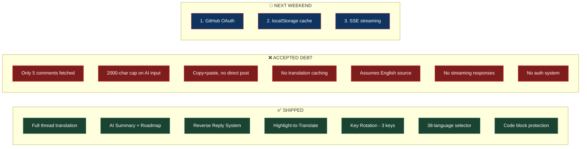

- **Only 5 comments fetched** — `per_page=5` on the GitHub API call. No pagination. If an issue has 200 comments, you see the first 5. Good enough for a demo, not for production.
- **No auth system** — Can't post replies directly to GitHub. The "Post to GitHub" button copies text and opens a new tab. OAuth was too complex for one weekend.
- **2000-char cap on AI input** — `body.substring(0, 2000)` before sending to Gemini. Long, detailed issue descriptions get truncated. The AI might miss context that's past the 2000-char mark.
- **No translation caching** — Every translation is a fresh API call. Translate Spanish → toggle off → toggle on = two API calls for the same content. A localStorage cache would fix this instantly.
- **Difficulty meter is pure heuristics** — Not AI-powered. A 3000-character issue might just be someone writing a really detailed (and easy) bug report. It's a gut check, not gospel.
- **Thread translation assumes English source** — `sourceLocale: 'en'` is hardcoded. If the original issue is in French, the translation still assumes it's English. Auto-detection for structured objects was unreliable.
- **No streaming** — User waits for the full Gemini response before seeing anything. Streaming via SSE would make summaries and roadmaps feel more interactive.

Would I fix all of these for a production app? Yes. Did I need to fix them to ship a working hackathon demo? No. Ship first, polish later.

---

## 🛠️ Tech Stack

| Layer | Technology | Why |
|-------|-----------|-----|
| Framework | Next.js 16 (App Router) | Server Actions, API routes, file routing |
| Language | TypeScript | Because `any` is not a personality type |
| Translation | Lingo.dev SDK | Fast, accurate, 38+ languages |
| AI | Google Gemini 2.5 Flash | Summary + roadmap generation |
| AI Resiliance | Key Rotation System | Triple the free-tier rate limits |
| Markdown | react-markdown + remark-gfm + rehype-raw | Full GFM support with raw HTML |
| Styling | Tailwind CSS 4 | Because writing CSS by hand is for people who enjoy pain |
| Icons | Lucide React | Clean, consistent, tree-shakeable |
| Toasts | Sonner | The best toast library. Fight me. |
| Utilities | clsx + tailwind-merge | `cn()` — the function in every Next.js project |

---

## 💡 What I Learned

**Translate less, not more.** The debounced live preview, the minimum character threshold, the per-comment translation instead of translate-everything — all of these reduce API calls without reducing usefulness. Less work = better UX = lower costs. Everyone wins exept the API provider.

**Code protection is non-negotiable.** If your translation tool touches code, it's broken. Period. The regex-extract-placeholder-restore pattern isn't sexy, but it works 100% of the time. And `split/join` > `.replace()` when your strings contain special charecters.

**Gemini's free tier is surprisngly good.** With key rotation, you can build real AI features without spending money. The summaries and roadmaps it generates are genuinly useful, not just gimmicks. The 2.5 Flash model is fast enough for interactive use.

**The floating toolbar pattern is underrated.** Instead of cluttering the issue header with buttons, putting the translation controls in a sticky bottom bar means they're always accesible regardless of scroll position. It's like a TV remote — always within reach, never in the way.

**Back-translation is the killer verification step.** Translating Hindi → Hindi (via English) as a verification preview is such a simple idea, but it completely changes the confidence level. If the back-translation matches your intent, you know the AI understood you. If it doesn't, you rephrase before commiting to the English version.

**Always have a fallback.** Every API call in IssueLingo has a fallback. Translation fails? Prepend "[Translated to X]". Gemini rate limited? Try the next key. All keys exhausted? Show the original text. The app never crashes. It might not always translate perfectly, but it never shows a blank screen.

---

## 🚀 Try It Yourself

```bash
git clone https://github.com/YOUR_USERNAME/IssueLingo.git
npm install
```

Create `.env.local`:

```
LINGO_API_KEY=your_lingo_dev_api_key
GEMINI_API_KEY_1=your_first_gemini_key
GEMINI_API_KEY_2=your_second_gemini_key
GITHUB_TOKEN=your_github_pat_optional
```

```bash
npm run dev
```

Open `http://localhost:3000`. Paste any GitHub issue URL. Hit "Translate Thread". Watch the entire discussion transform into your language while every `useState` and `git rebase` stays perfectly intact.

Then try the Reverse Reply — write something in your language, watch the live preview appear, finalize it to English, and post it to GitHub. You just contributed to open source without writing a single word of English.

---

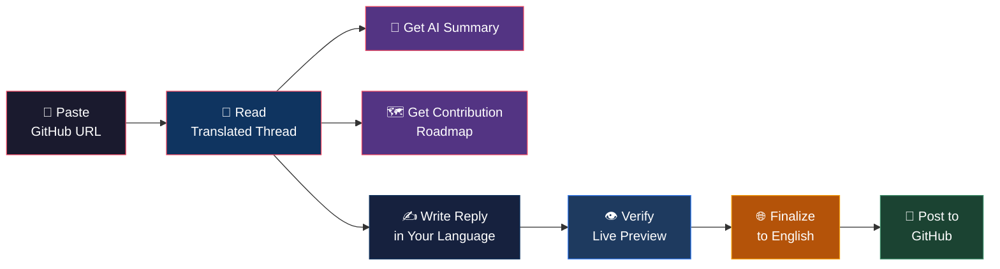

<!-- 📸 SCREENSHOT #7: Full Demo Flow
     What to capture: A composite/collage image showing the complete journey:
     Landing page → Translated thread → AI Summary → Roadmap → Reply in Hindi → English output.
     Can stitch 3-4 screenshots together with arrows between them.
-->
<!--  -->
<!-- *From paste to translation to AI summary to contribution roadmap to reverse reply — the complete IssueLingo experience in one screenshot.* -->

From paste to translation to contribution — all without ever leaving IssueLingo.

---

## 🔮 What's Next — Fork This and Build

If someone forks this repository today, here's what I'd build next:

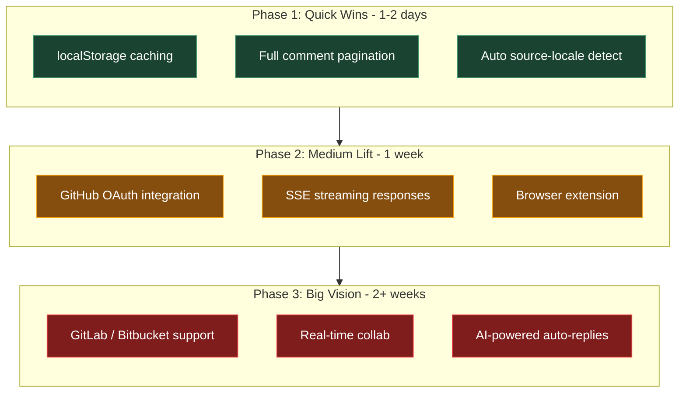

1. **GitHub OAuth Integration** — The most obvious missing piece. Let users authenticate with GitHub and post replies directly from IssueLingo. No more copy-paste-open-tab dance.
2. **Translation Caching** — Store translations in localStorage (or Redis for a deployed version). Toggle off and on shouldn't cost another API call.
3. **Streaming AI Responses** — Use Server-Sent Events to stream Gemini's output token by token. Summaries and roadmaps should appear progressively, not after a loading spinner.
4. **Browser Extension** — Now that the architecture is proven, a Chrome extension could inject translation controls directly into GitHub's issue pages. The API proxy would still handle the heavy lifting.
5. **GitLab / Bitbucket Support** — The translation logic is platform-agnostic. Adding GitLab or Bitbucket support is mostly about parsing different URL formats and API responses.
6. **Full Comment Pagination** — Fetch all comments, not just the first 5. Add infinite scroll or "Load More" for issues with 100+ comments.
7. **Real-time Collaborative Translation** — Multiple contributors translating different comments simultaneously, with live updates via WebSockets.

The codebase is modular enough that any of these could be added without rewriting existing features. The API routes are independent, the components are isolated, and the translation logic is centralized in three utility functions.

**If you want to contribute**, the most impactful first PR would be GitHub OAuth. It turns IssueLingo from a "read and translate" tool into a complete "read, translate, and contribute" platform.

---

Built for the **Lingo.dev Hackathon** with ❤️, too much caffiene, `split/join` instead of `.replace()`, and the firm belief that language should never be a barrier to open source contribution.

*If the translation says something wierd, it's probably because the AI had a bad day. Or maybe the original issue was just that confusing. 🤷‍♂️*
