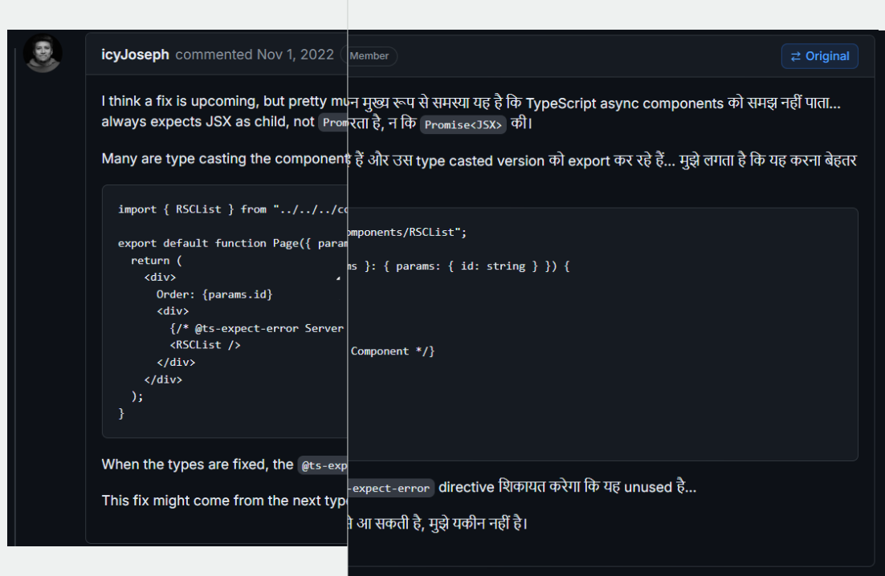
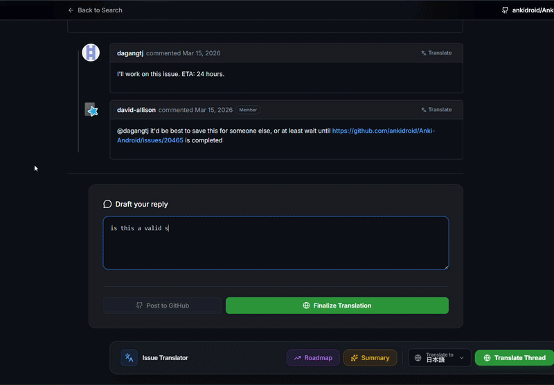
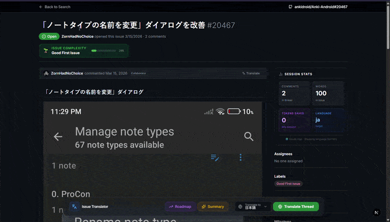
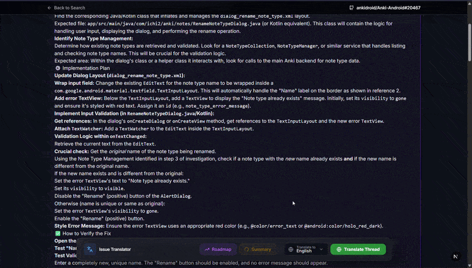
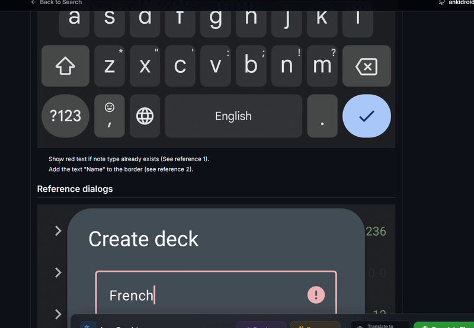
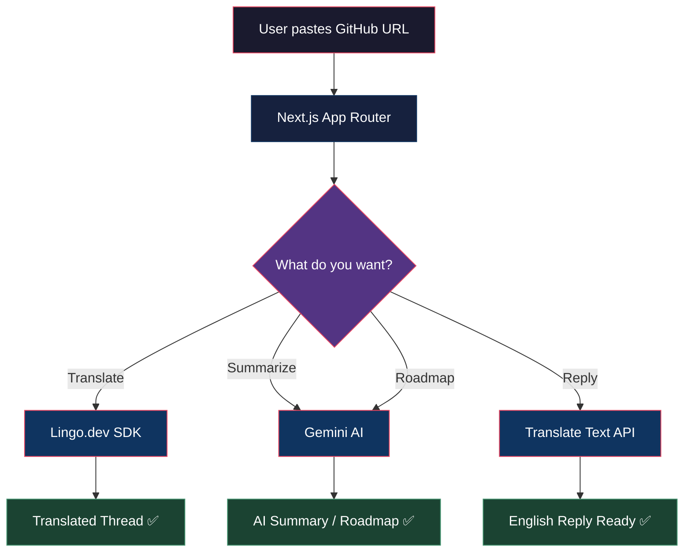

# IssueLingo 🌐🏁

> *"I just want to fix a bug, why is this issue in Mandarin?"* — Every developer, at least once.

[](https://nextjs.org)
[](https://ai.google.dev)
[](https://lingo.dev)

IssueLingo is that tool you didn't know you needed untill you stared at a GitHub issue for 10 minutes before realizing it wasn't even in English. It translates, summarizes, and helps you contribute to open source — no matter what language the issue is writen in.

---

## 📖 Table of Contenst

- [Why tho?](#-why-tho)
- [Features](#-features-the-cool-stuff)
- [Screenshots & Demo](#-screenshots--demo)
- [How it Works](#-how-it-works)
- [Architecture](#-architecture-fancy-word-for-how-things-connect)
- [Getting Started](#-getting-started)
- [The Reply Flow](#-the-reply-flow-this-is-the-cool-part)
- [Tech Stack](#-tech-stack)
- [API Endpoints](#-api-endpoints)
- [Contributing](#-contributing)
- [License](#-license)

---

## 🤔 Why tho?

Open source is supposed to be for eveyone. But "everyone" speaks like 7,000+ languages and most issues are in maybe... 5 of them? That's not great.

```
  The Problem:
  
  🧑‍💻 You:     "I want to help fix this React bug!"
  📄 Issue:    *written entirely in Japanese*
  🧑‍💻 You:     "...nevermind"
```

We fix that. You paste a GitHub issue URL, we translate the whole thread, give you a roadmap, and even help you write a reply back in English. Its like having a polyglot friend who also happens to be really good at code.

---

## 📸 Screenshots & Demo

### 🎥 Watch the Demo
[](https://youtu.be/1kPQ3lUVilI)
*

### 🛡️ The "Don't Touch My Code" Guarantee
Unlike basic browser translation, IssueLingo translates the prose but protects your JSON, terminal commands, and markdown perfectly.


### 🧠 Features in Action

| Reverse Reply | Thread-Translate  |
| :---: | :---: |
|  |  |

| AI Summary  |  Select-to-Translate  |
| :---: | :---: |
|  |  |

---

## ✨ Features (the cool stuff)

### 🌍 Full Thread Translation
Translate the entire issue — title, body, AND all comments — into any of **38+ languages**. Code blocks stay untouched because nobody wants their `console.log` translated to `consola.registro`.

### 🧠 AI-Powered Summery
Got 47 comments on a thread? Ain't nobody reading all that. Hit the summary button and get the TL;DR in seconds. Powered by Gemini, so it's actualy pretty smart.

### 🗺️ Contribution Roadmap
The AI reads the issue and tells you exactly what to fix, which files to look at, and how to test it. It's like a senior developer reviewing the issue for you, except it doesnt judge your commit messages.

### ✍️ Smart Reply System
Write your reply in YOUR language → see a live preview → finalize it into polished English → post to GitHub. More on this below because honestly this is the coolest part.

### 🔑 API Key Rotation
Running out of free tier Gemini calls? Just add more keys! The app rotates through them automaticaly. Infinite power* (*not actually infinite, please dont sue us).

---

## ⚙️ How it Works

```
┌─────────────────────────────────────────────────────────┐
│                                                         │
│   You paste a GitHub issue URL                          │
│                                                         │
│         │                                               │
│         ▼                                               │
│   ┌───────────┐     ┌──────────────┐                    │
│   │  Next.js   │────▶│  GitHub API   │                   │
│   │  Frontend  │◀────│  (fetching)   │                   │
│   └─────┬─────┘     └──────────────┘                    │
│         │                                               │
│         │  "translate plz"                               │
│         ▼                                               │
│   ┌───────────┐     ┌──────────────┐                    │
│   │  API       │────▶│  Lingo.dev    │                   │
│   │  Routes    │     │  SDK          │                   │
│   └─────┬─────┘     └──────────────┘                    │
│         │                                               │
│         │  "summarize & roadmap plz"                     │
│         ▼                                               │
│   ┌───────────────┐                                     │
│   │  Gemini 2.5    │                                     │
│   │  Flash ⚡      │                                     │
│   └───────────────┘                                     │
│                                                         │
│         │                                               │
│         ▼                                               │
│                                                         │
│   🎉 You can now understand & contribute!               │
│                                                         │
└─────────────────────────────────────────────────────────┘
```

---

## 🏗️ Architecture (fancy word for "how things conect")



---

## 🚀 Getting Startd

### Prerequisites

- Node.js 18+ (we belive in modern JavaScript)
- A Gemini API key ([get one free here](https://ai.google.dev))
- A Lingo.dev API key ([grab it here](https://lingo.dev))
- Optionally, a GitHub token (for higher rate limtis)

### Installation

```bash
# Clone the repo (you know the drill)
git clone https://github.com/pavitra0/issuelingo.git
cd issuelingo

# Install dependancies
npm install

# Set up your enviroment variables
cp .env.example .env.local
```

### Environment Variables

Create a `.env.local` file (dont commit this, serioulsy):

```env
# Required - at least one Gemini key
GEMINI_API_KEY_1=your_gemini_key_here
GEMINI_API_KEY_2=another_one_if_you_want   # optional, for key rotation
GEMINI_API_KEY_3=go_crazy                   # optional, more = better

# Required - for translations
LINGO_API_KEY=your_lingo_dev_key_here

# Optional - bumps GitHub API rate limit from 60 to 5000 req/hr
GITHUB_TOKEN=your_github_pat_here
```

### Run it

```bash
npm run dev
```

Then open [http://localhost:3000](http://localhost:3000) and paste a GitHub issue URL. That's it. That's the whole thing. We're not overcomplicating this.

---

## 💬 The Reply Flow (this is the cool part)

This is where it gets fun. Say you speak Hindi and want to reply to an English issue:

```
┌──────────────────────────────────────────────────┐
│                                                  │
│  Step 1: You write in Hindi                      │
│  ┌────────────────────────────────────────┐      │
│  │ यह बग तब होता है जब आप बटन पर         │      │
│  │ दो बार क्लिक करते हैं                    │      │
│  └────────────────────────────────────────┘      │
│                    │                             │
│                    ▼  (live as you type!)         │
│                                                  │
│  Step 2: Verification Preview ✅                 │
│  ┌────────────────────────────────────────┐      │
│  │ "This bug happens when you click the   │      │
│  │  button twice"                         │      │
│  └────────────────────────────────────────┘      │
│          Does this look right? ^                 │
│                    │                             │
│                    ▼  (click "Finalize")          │
│                                                  │
│  Step 3: Polished English for GitHub 🚀          │
│  ┌────────────────────────────────────────┐      │
│  │ "This bug occurs when the button is    │      │
│  │  clicked twice in quick succession."   │      │
│  └────────────────────────────────────────┘      │
│                                                  │
│  → Copy & post to GitHub! 🎉                     │
│                                                  │
└──────────────────────────────────────────────────┘
```

The verificaiton step is key — it lets you make sure the AI actually understood what you ment before it crafts the final English version. No more "I hope this makes sence" anxiety.

---

## 🛠️ Tech Stack

| Technology | What it does | Why we picked it |
|---|---|---|
| **Next.js 16** | App framework | Because it's fast and we're lazy (efficent*) |
| **React 19** | UI stuff | It's React. You know why. |
| **Tailwind CSS 4** | Styling | Writing CSS by hand is a form of self harm |
| **Gemini 2.5 Flash** | AI brain | Fast, smart, and the free tier is generous |
| **Lingo.dev SDK** | Translations | Object-level translation that preserves structure |
| **Lucide Icons** | Pretty icons | They make everything look 40% more profesional |
| **Sonner** | Toast notifications | For when things go wrong (or right!) |

*we ment efficient

---

## 📡 API Endpoints

```
POST /api/fetch-issue        → Fetches issue + comments from GitHub
POST /api/translate-issue    → Translates entire thread via Lingo.dev  
POST /api/translate-text     → Translates a single text blob
POST /api/translate-reply    → Polishes reply into English
POST /api/summarize          → AI summary of the thread
POST /api/generate-roadmap   → AI contribution roadmap
```

All endpoints live in `src/app/api/` because Next.js App Router is cool like that.

---

## 🗂️ Project Strucutre

```
src/
├── app/
│   ├── api/
│   │   ├── fetch-issue/        # GitHub data fetching
│   │   ├── generate-roadmap/   # AI roadmap generation  
│   │   ├── summarize/          # AI thread summmary
│   │   ├── translate-issue/    # Full thread translation
│   │   ├── translate-reply/    # Reply finalization
│   │   └── translate-text/     # General text translation
│   ├── issue/
│   │   └── [...slug]/          # Dynamic issue page (/issue/owner/repo/123)
│   ├── globals.css             # Global styles + GitHub markdown theme
│   ├── layout.tsx              # Root layout with Inter font
│   └── page.tsx                # Landing page with URL input
├── components/
│   ├── IssueCommentCard.tsx    # Comment rendering with hover translate
│   └── LanguageSelector.tsx    # Language picker (38+ langs, grouped by region)
└── lib/
    ├── gemini.ts               # Gemini client with key rotation magic
    ├── languages.ts            # Language definitions & helpers
    └── utils.ts                # Utility functions (cn, etc.)
```

---

## 🌎 Supported Langauges

We support **38+ languages** across 7 regions, because open sorce is global:

```
🇪🇺 European       → English, Spanish, French, German, Italian, Portuguese,
                       Russian, Polish, Dutch, Swedish, Ukrainian, Romanian,
                       Czech, Greek

🇨🇳 East Asian     → Chinese (Simplified), Chinese (Traditional),
                       Japanese, Korean

🇮🇳 South Asian    → Hindi, Bengali, Urdu, Tamil, Telugu, Marathi

🇹🇭 Southeast Asian → Indonesian, Thai, Vietnamese, Malay, Filipino

🇸🇦 Middle Eastern  → Arabic, Persian, Turkish, Hebrew

🇰🇪 African        → Swahili, Amharic, Hausa

🌎 Americas        → Portuguese (Brazil), Spanish (Mexico)
```

---

## 🤝 Contributing

Found a bug? Want to add Klingon support? PRs are welome!

1. Fork the repo
2. Create your branch (`git checkout -b feature/klingon-support`)
3. Make your changes (and maybe add some tests, we wont judge)
4. Push and open a PR
5. Wait for us to review (we're fast, promise... mostly)

Please don't translate the code comments into Klingon though. We tried. It didn't go well. 💀

---

## 📝 License

MIT — do watever you want with it. Seriously. Go wild. Just don't blame us if the AI translates "bug fix" into "insect repair" in production.

---

<p align="center">
  Made with ❤️, too much caffiene, and the occasional mass of confusoin about Unicode encodings.<br/>
  <sub>If you read this far, you deserve a mass of coffee. Go get some. ☕</sub>
</p>
